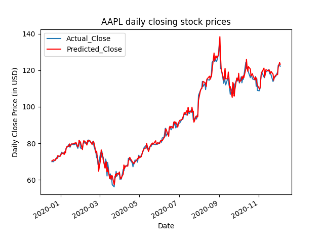

## Abstract
Hidden Markov Models are an incredibly interesting type of stochastic process that is underutilized in the
Machine Learning world. They are particularly useful for analyzing time series. This, combined with their ability to 
convert the observable outputs that are emitted by real-world processes into predictable and efficient models makes
them a viable candidate to be used for stock market analysis. The stock market
has several interesting properties that make modeling non-trivial, namely
volatility, time dependence, and other similar complex dependencies. HMMs
are suited to dealing with these complications as the only information they
require to generate a model is a set of observations (in this case historical stock market data).

## Example
AAPL training and prediction example of stock prices between January 1st, 2018 to December 5th, 2020; the prediction is 5 days into the future.



## Dependencies
* Pandas - Required for data processing
* Pandas_datareader - Allows one to download data directly from Yahoo! Finance
* NumPy - Required for fast manipulation of financial data (e.g. calculating fractional change)
* Matplotlib - Required for visualization of results
* Hmmlearn - Open source package that allows for creation and fitting of HMM's 
* Sklearn/Scikit-learn - Used to calculate metrics to score the results and split the data, will be removed in the future to reduce dependency
* Tqdm - Used to track progress whilst training
* Argparse - Required for console inputs
* YFinance - Needed for the updated data extraction from Yahoo! Finance
* TensorFlow - Required for GPU acceleration; this is currently being properly implemented
* Flask - Required for displaying the charts of your predictions through your browser
* Livereload - Only recommended if you intend on working on the code... 

## Method
Stock market data is downloaded via pandas_datareader and the data is split into training and testing datasets. The 
fractional changes for any given day (from open to close, high to open, open to low) in the training dataset are computed and stored in a NumPy 
array. These fractional changes can be seen as the observations for the HMM and are used to train the continuous HMM 
with hmmlearn's fit method. The model then predicts the closing price for each day in the training dataset, based on the given 
day's opening price. This prediction is found by calculating the highest-scoring potential outcome out of a pre-determined 
set of outcomes (e.g. +0.001%, -0.001% etc). All predictions as well as the actual close prices for the testing period are stored in an 
Excel file and the Mean Squared Error between the two is printed out. The MSE is also included in the file name for future 
reference. Future days are predicted by feeding forward the prediction values. Unfortunately, at present there is no method in place to account 
for overnight/ weekend futures trading, and so for the future predictions the n+1 days open price is the same as the nth days closing price. 

## Installation

### Linux
```shell
sudo apt-get install libopenjp2-7 libtiff5
pip install -r requirements.txt
```

## Usage 
Within the src directory:
```shell
python stock_analysis.py [-n XXXX] [-s yyyy-mm-dd] [-e yyyy-mm-dd] [-o dir] [-p T/F] [-f int] [-m T/F]
python stock_analysis.py -n AAPL -s 2018-01-01 -e 2023-08-22 -o /home/bw/Projects/HMMs_Stock_Market -p True -f 5 -m True

```
The -n input represents a given stock name, -s is the start date of the period considered, -e is the end date of the period considered, 
and -o takes in the output directory for the Excel file produced. It is important that the dates are input in the correct
order. -p is a boolean input that tells the script whether or not to plot the historical dates, it will have no effect if -m is not also set to true. 
-f stands for future and takes in an integer that determines how many days into the future the user would like to predict. 
-m stands for metrics and determines whether or not to predict for the historical data, or just for the future days, if True all of the historical data in the
test set will be predicted and the Mean Squared Error will be returned. The justification for -m being an optional input is that the model can take quite some time to 
predict, so it's best if the user has the option to just predict the close prices for x future days quickly as that is the information that many people will find most 
useful. 

To run tests, use:
```shell
python3 -m pytest tests
```

To run tests using docker, use:
```shell
docker-compose up tests
```
# markovMaker
